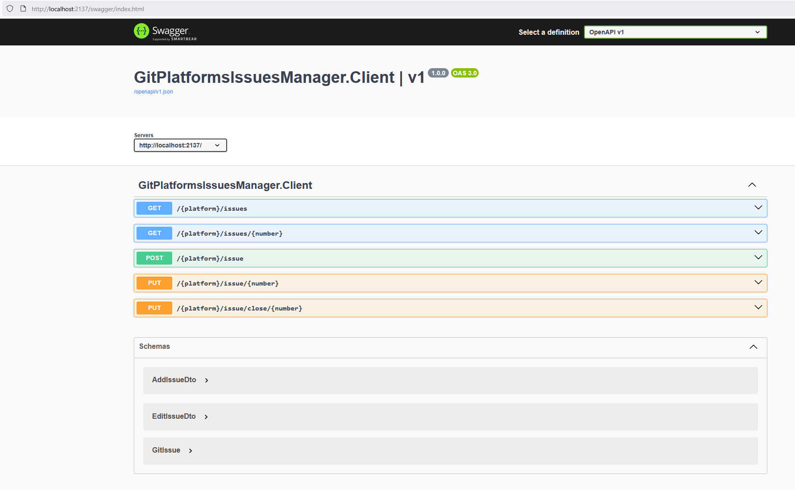

## Git platforms issues manager
Primitive library and REST API client to manage issues on Git platforms (supported so far: GitHub and GitLab)

### Prerequisites
* .NET9

### How to run project
* Clone repository
* In _Client_ project, find a file _platforms.json_ and for each platform, find an array of type _RequestHeaders_ and enter your Authorization key:
  ```json
  {
        "Name": "Authorization",
        "Value": "Bearer <<ENTER_YOUR_API_KEY_HERE>>"
  }
  ```
* build _Client_ to affect your access tokens: ```dotnet build```
* run _Client_ project using command: ```dotnet run```
  or alternatively enable Hot Module Reloading, if you want to track code changes: ```dotnet watch run```
* navigate in your internet browser to the address: ```http://localhost:2137/swagger```
* you should see something like this:


### How to run unit tests
Trust me, you don't want to do that 😉 but if you really have to, navigate in Terminal to the project _GitPlatformsIssuesManager.Tests_ and, in order to run all created tests, fire command ```dotnet test```.

### Available actions
* List repository issues
* Get single issue by ID
* Add new issue
* Edit selected issue's title and/or description
* Close selected issue